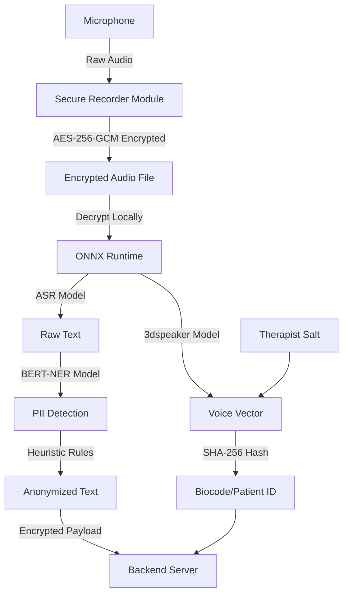

# Tiro Scribe

> **"Notes Tironiennes" for the 21st Century.**
> A privacy-first clinical transcriber that converts speech to anonymized text on-device, without ever storing raw audio.

## ⚠️ License & Usage Warning
**This software is NOT Open Source in the traditional sense.**
It is licensed under the **PolyForm Noncommercial License 1.0.0**.

* ✅ **Allowed:** Use by academic researchers, universities, public hospitals, and non-profits for scientific research.
* ❌ **Prohibited:** Any commercial use, sale, or usage by for-profit entities is **strictly forbidden**.

---

## 📖 The Mission
This project aims to create **secure transcripts and text anonymization tools** for building scientific datasets in clinical psychology research.

Inspired by **Lester Luborsky's CCRT (Core Conflictual Relationship Theme)** method, which requires precise session transcripts for rigorous analysis, **Tiro Scribe** addresses the critical bottleneck: **Data Privacy**. GDPR and medical ethics often make recording impossible or risky, preventing researchers from building the datasets needed for scientific advancement.

**Tiro Scribe** implements a **privacy-first, privacy-by-design** architecture. Instead of acting as a simple recorder that stores sensitive files, the mobile device acts as a "Privacy Airlock" that performs **Edge AI processing** and outputs only anonymized, safe data suitable for scientific research.

## 🏛️ About the Name
Named after **Marcus Tullius Tiro**, the father of shorthand (stenography) and faithful scribe of Cicero. Just as Tiro captured spoken words immediately without interfering with the speech, this tool captures clinical data without compromising patient privacy.

## 🛡️ The Security Protocol (Biocode & Salt)

This application implements a strict **Privacy-by-Design** architecture. No raw audio ever leaves the device.

### 🔐 Secure Recording

Audio is captured with **streaming AES-256-GCM encryption** via the `secure-recorder` module:
- Audio data is encrypted in real-time before being written to disk
- **Zero unencrypted temporary files** - data flows directly from microphone → encryption → file
- Keys are stored in hardware-backed secure storage (AndroidKeyStore/Keychain)
- Supports background processing with keys accessible after device unlock

### 🤖 AI Models & Processing

All AI processing runs **on-device** using **ONNX Runtime**:

#### Currently Implemented:
1. **Speaker Recognition Model**: 
   - **Model**: `3dspeaker_speechbrain.zipformer.onnx` (Sherpa-ONNX format)
   - **Purpose**: Extracts speaker voice vectors for biocode generation
   - **Source**: [Sherpa-ONNX releases](https://github.com/k2-fsa/sherpa-onnx/releases)

2. **BERT-NER Model** (Named Entity Recognition):
   - **Model**: Quantized BERT model for entity detection
   - **Purpose**: Detects PII (Persons, Locations) in transcribed text
   - **Format**: ONNX quantized model

#### Planned:
- **Transcription Model**: ASR model for speech-to-text conversion (currently in development)

### Data Flow
1.  **Secure Acquisition:** Audio is captured with streaming encryption using the `secure-recorder` module. Encrypted files are stored locally with AES-256-GCM.
2.  **On-Device Transcription:** (Planned) ONNX-based ASR model will transcribe speech to text **offline**.
3.  **Biocoding (Voice Fingerprinting):**
    * The system extracts a voice vector using the **3dspeaker SpeechBrain Zipformer** model via ONNX Runtime.
    * This vector is **salted** with the Therapist's ID using SHA-256.
    * **Result:** A unique, consistent Patient Hash that allows longitudinal tracking without ever knowing the patient's real identity.
4.  **Dynamic Pseudonymization:**
    * **Layer 1 (AI)**: ONNX BERT-NER model detects direct PII (names, places) with confidence scores.
    * **Layer 2 (Heuristics)**: Rule-based detection of indirect identifiers (family roles like "father", "mother", or "boss").
    * **Context-Aware Replacement:** Entities are replaced by tokenized tags (e.g., `Mother` -> `[RELATION_A]`, `Lyon` -> `[CITY_HASH]`).
    * **Temporal Fuzzing:** Exact dates are converted into **relative timestamps** (e.g., `Day +14`) to preserve the clinical timeline while masking specific calendar days.
5.  **Secure Transmission:** Only the anonymized transcript and the Biocode are sent to the backend (`tiro-scribe-server`).

## 🏗️ Architecture

### Tech Stack
- **Framework**: Expo SDK 54 (React Native 0.81.5)
- **AI Runtime**: ONNX Runtime for React Native (`onnxruntime-react-native`)
- **Database**: WatermelonDB (local SQLite)
- **State Management**: Legend State
- **Navigation**: React Navigation
- **UI**: React Native Paper

### Key Components
- **`secure-recorder`**: Custom Expo native module for encrypted audio recording
- **`Biocode`**: Speaker recognition and patient ID generation
- **`Anonymizer`**: Multi-layer PII detection and replacement
- **`AudioProcessing`**: Orchestrates the complete processing pipeline
- **`Queue`**: Background processing queue for audio files