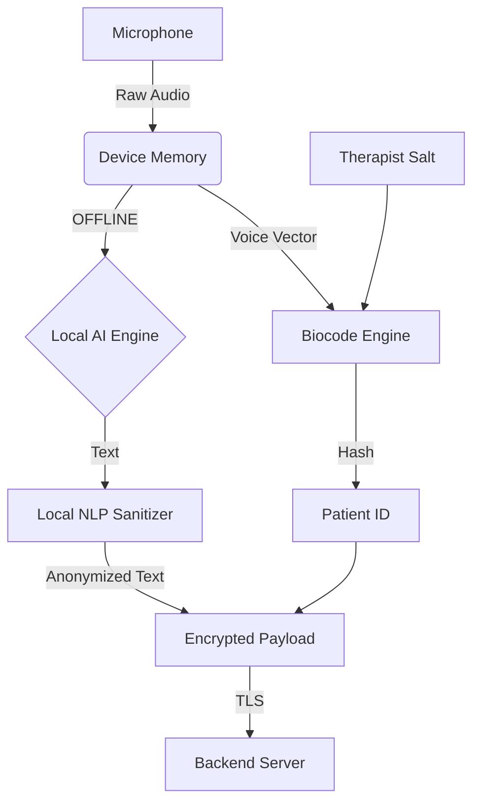

# Open Luborsky Mobile

[](LICENSE)
[](https://github.com/Diwatt/open-luborsky-mobile)
[](https://reactnative.dev/)

> **A privacy-first clinical engineering implementation to enable modern psychotherapy research based on Lester Luborsky's methods.**

## ⚠️ License & Usage Warning
**This software is NOT Open Source in the traditional sense.**
It is licensed under the **PolyForm Noncommercial License 1.0.0**.

* ✅ **Allowed:** Use by academic researchers, universities, public hospitals, and non-profits for scientific research.
* ❌ **Prohibited:** Any commercial use, sale, or usage by for-profit entities without prior written authorization from the author.

---

## 📖 The Mission
This project aims to solve the biggest bottleneck in clinical psychology research: **Data Privacy.**
Applying Lester Luborsky's rigorous analysis methods requires recording sessions, but GDPR and medical ethics often make this impossible or risky.

**Open Luborsky** shifts the paradigm by performing **Edge AI processing**. Instead of sending sensitive audio to a cloud server, the mobile device acts as a "Privacy Airlock."

## 🛡️ The Security Protocol (Biocode & Salt)

This application implements a strict **Privacy-by-Design** architecture. No raw audio ever leaves the device.

### Data Flow
1.  **Acquisition:** Audio is recorded locally on the therapist's device.
2.  **On-Device Transcription:** We use state-of-the-art (SOTA) ASR models to transcribe speech to text **offline**.
3.  **Biocoding (Voice Fingerprinting):**
    * The system extracts a voice vector using embedded AI.
    * This vector is **salted** with the Therapist's ID.
    * **Result:** A unique, consistent Patient Hash that allows longitudinal tracking without ever knowing the patient's real identity.
4.  **Dynamic Pseudonymization:**
    * Local NLP detects direct PII (names, places) and **indirect identifiers** (family roles like "father", "mother", or "boss").
    * **Context-Aware Replacement:** Entities are replaced by tokenized tags (e.g., `Mother` -> `[RELATION_A]`, `Lyon` -> `[CITY_HASH]`).
    * **Temporal Fuzzing:** Exact dates are not destroyed but converted into **relative timestamps** (e.g., `Day +14`) or generalized years to preserve the clinical timeline while masking specific calendar days.
5.  **Secure Transmission:** Only the anonymized transcript and the Biocode are sent to the backend (`open-luborsky-server`).



## 🏗️ Architecture

This project follows **Clean Architecture** with a **feature-based** folder structure:

```
src/
  core/              # Core business logic
    models/          # Type definitions
    services/        # AI services (Biocode, Anonymizer, AudioProcessing)
    store/           # Zustand global state
    utils/           # Shared utilities
  features/          # Feature modules
    recording/       # Audio recording feature
  navigation/        # React Navigation setup
  database/          # WatermelonDB schema
```

## 🚀 Getting Started

### Prerequisites

- Node.js >= 18.0.0
- React Native CLI
- iOS: Xcode 14+
- Android: Android Studio with SDK 33+

### Installation

1. **Install dependencies:**
   ```bash
   pnpm install
   ```

2. **Install native modules (manual installation required):**
   
   The following native modules need to be installed manually as they may not be available on npm:
   - `whisper.rn` - Speech-to-Text
   - `sherpa-onnx-react-native` - Speaker recognition
   - `onnxruntime-react-native` - ONNX Runtime
   
   Follow the installation instructions for each module in their respective repositories.

3. **Install iOS dependencies:**
   ```bash
   cd ios && pod install && cd ..
   ```

4. **Run the app:**
   ```bash
   # iOS
   pnpm run ios
   
   # Android
   pnpm run android
   ```

## 📦 Core Services

### BiocodeService
- Extracts speaker vectors using `sherpa-onnx`
- Implements salting: `Hash(SpeakerVector + TherapistID_Salt) = PatientID`
- Calculates cosine similarity for speaker recognition

### AnonymizerService
Hybrid three-layer anonymization:
1. **Layer 1 (AI):** ONNX BERT-NER for detecting `PER` (Persons) and `LOC` (Locations)
2. **Layer 2 (Heuristics):** Regex/rule engine for family/work relations
3. **Layer 3 (Temporal Fuzzing):** Date/time shifting to relative timestamps

### AudioProcessingService
Orchestrates the complete pipeline:
- Audio → Whisper → Raw Text
- Raw Text → Anonymizer → Clean Text
- Audio → Sherpa → Biocode
- Final Payload: `{ biocode, cleanTranscript, confidence }`

## 🗄️ Database

WatermelonDB is used for offline-first data storage:
- **Sessions**: Therapy session metadata
- **Recordings**: Processed audio recordings with biocodes
- **Sync Queue**: Offline queue for backend synchronization

## 🔧 Development

### Type Checking
```bash
pnpm run type-check
```

### Linting
```bash
pnpm run lint
```

## 📝 Cursor Rules

This project includes Cursor rules for:
- Privacy-by-Design architecture
- Clean Architecture patterns
- AI services implementation
- TypeScript standards
- Offline-first patterns

Rules are located in `.cursor/rules/` and are automatically applied by Cursor.

## 🔐 Security Notes

- All AI processing occurs on-device
- No raw audio or unprocessed text is transmitted
- Biocodes are deterministic but irreversible
- Temporal fuzzing preserves clinical timeline
- TLS required for all backend communication

## 📄 License

PolyForm Noncommercial License 1.0.0 - See [LICENSE](LICENSE) for details.

## 🤝 Contributing

This project is designed for academic and non-profit research use. Contributions from researchers and developers working in clinical psychology, privacy-preserving AI, or related fields are welcome.

---

**Built with privacy-first principles for clinical research.**
